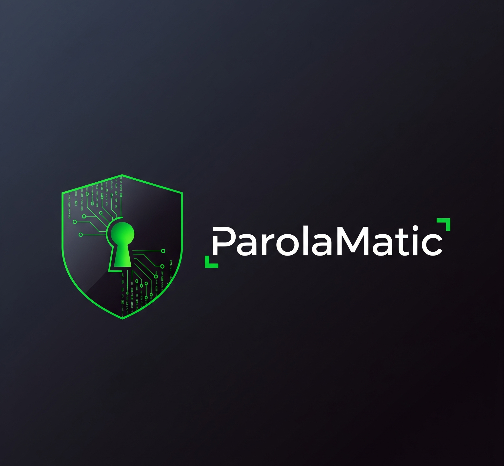

# Password Generator Chrome Extension / Parola Üretici Chrome Eklentisi

## Screenshots / Ekran Görüntüleri

## English

This is a simple Chrome extension that generates strong passwords with customizable options and a professional glassmorphism UI theme.

### Features
- Customizable password length (4-32 characters)
- Options: Easy to say, Easy to read, All characters, Uppercase, Lowercase, Numbers, Symbols
- Generate button to create password
- Copy button to copy generated password to clipboard
- Modern glassmorphism design

### Installation
1. Download the extension folder.
2. Open Chrome and go to `chrome://extensions/`.
3. Enable Developer Mode (toggle in top right corner).
4. Click 'Load unpacked' and select the extension folder.

### Usage
- Click the extension icon.
- Adjust options and length.
- Click 'Generate' to create a password.
- Click 'Copy' to copy it.

No dependencies required.

---

## Türkçe

Bu, özelleştirilebilir seçenekler ve profesyonel glassmorphism UI teması ile güçlü parolalar üreten basit bir Chrome eklentisidir.

### Özellikler
- Özelleştirilebilir parola uzunluğu (4-32 karakter)
- Seçenekler: Söylemesi kolay, Okumasi kolay, Tüm karakterler, Büyük harf, Küçük harf, Sayılar, Semboller
- Parola oluşturmak için üretim butonu
- Oluşturulan parolayı panoya kopyalamak için kopyala butonu
- Modern glassmorphism tasarım

### Kurulum
1. Eklenti klasörünü indirin.
2. Chrome'u açın ve `chrome://extensions/` adresine gidin.
3. Geliştirici Modunu etkinleştirin (sağ üst köşedeki toggle).
4. 'Paketlenmemiş yükle' seçeneğine tıklayın ve eklenti klasörünü seçin.

### Kullanım
- Eklenti simgesine tıklayın.
- Seçenekleri ve uzunluğu ayarlayın.
- Parola oluşturmak için 'Üret' butonuna tıklayın.
- Kopyalamak için 'Kopyala' butonuna tıklayın.

Herhangi bir bağımlılık gerektirmez.

---

## Project Members / Proje Üyeleri

- **Enes Kavruk** - [GitHub](https://github.com/ekavruk)
- **Doğukan Kurnaz** - [GitHub](https://github.com/dogukankurnaz)
